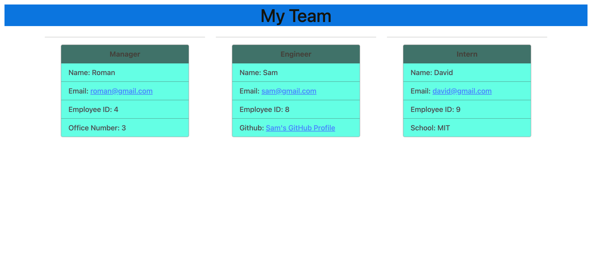

# <Team-Profile-Generator.>

# Mission
    * to build a NODE.js command line application that takes in information about employees on a team then generates a HTML webpage whcih displays the summaries of each person
    * to feature dynamically updated HTML & CSS
    * have a clean, polished and responsive user interface

# Parameters
    
    Given the command line applciation which takes the user input;

    * when prompted for team members and their information,
        an HTML file is generated that displays a nicely formated card based on user input
    * when the application is run and all the prompted inputs are entered and building team is done,
        a clean HTML file is generated
    * when clicked on email address in the HTML,
        then the user's default email program opens and populates the TO field
    * when clicked of GITHUB username,
        then GITHUB profile opens in the new tab
    

# Link to the GITHUB page

https://github.com/roman-ac/team-profile-generator

# Link to the walkthrough video

https://watch.screencastify.com/v/pYwrQUfewFYPYwxpHUi6

# Screenshot

   